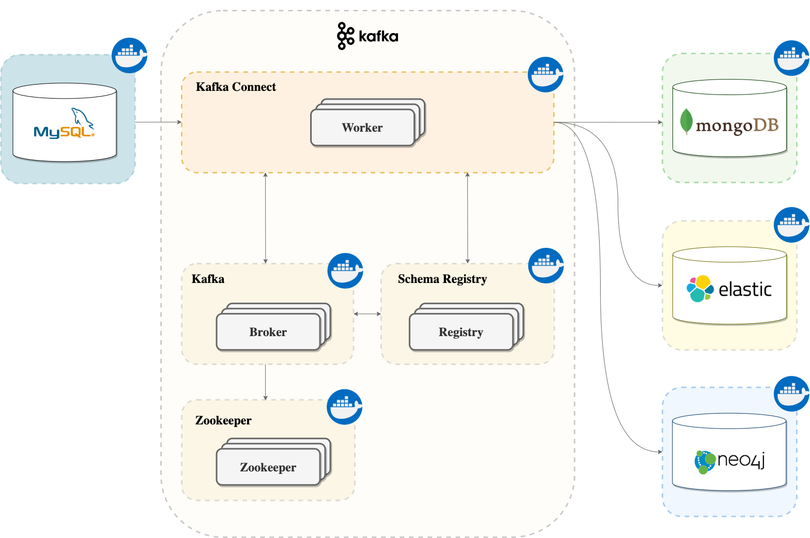

# UoL - Heterogeneous database replication

This project is a prototype that uses Docker, Kafka and Kafka Connect to synchronise state accross heterogeneous storage technologies. The diagram below shows the system architecture.



## Table of contents

  - [1. Project structure](#1-project-structure)
  - [2. Dependencies](#2-dependencies)
    - [Core dependencies](#core-dependencies)
    - [Optional depndencies](#optional-depndencies)
  - [3. Dataset](#3-dataset)
  - [4. Project setup](#4-project-setup)
  - [5. Evaluation](#5-evaluation)
    - [Insert records](#insert-records)
    - [Check inconsistencies](#check-inconsistencies)
  - [6. Monitoring](#6-monitoring)
  - [7. Results](#7-results)
  - [8. Useful commands](#8-useful-commands)

## 1. Project structure

| File/Folder        | Description                                                              |
| ------------------ | ------------------------------------------------------------------------ |
| data               | MySQL server configuration files and database migrations.                |
| datasets           | Original and test datasets used to evaluate the system.                  |
| docs               | Images used in this document.                                            |
| evaluation         | Scripts to insert records from the dataset and evaluate inconsistencies. |
| monitoring         | JMXTerm .jar with JMX commands to extract metrics.                       |
| results            | CSV files the results for every test case.                               |
| setup              | Infrastructure and system configuration scritps.                         |
| utils              | Utility scripts for monitoring the system.                               |
| docker-compose.yml | Docker multi-container configuration file.                               |

## 2. Dependencies

### Core dependencies

| Dependency | Description                                              |
| ---------- | -------------------------------------------------------- |
| Docker     | Used for containerising the environment.                 |
| Java       | Used for running JMXTerm, an interactive CLI JMX client. |
| Node.js    | Used running the evaluation programs.                    |

### Optional depndencies

| Dependency | Description                   |
| ---------- | ----------------------------- |
| jq         | Used for easily parsing JSON. |

## 3. Dataset

The `./dataset` directory contains two datasets extracted from the NASA exoplanet archive ([https://exoplanetarchive.ipac.caltech.edu/](https://exoplanetarchive.ipac.caltech.edu/)):

- `PS_2020.11.23_01.56.29.csv` - Original dataset
- `test.11.23_01.56.29.csv` - Test dataset

The test dataset is a subsample of the original dataset that only contains 100 records. It is intented to be used for testing the evaluation programs but the actual evaluation should be done with the original dataset.

## 4. Project setup

```sh
# Create and initialise containers
docker-compose up -d

# Confirm Kafka Connect is ready to accept connections
./utils/is-connect-ready.sh
```

Once Kafka Connect is ready, proceed to configure all the connectors

```sh
cd ./setup

# Configure all connectors
./setup-connectors.sh

# Alternatively configure individual connectors:

# Create MySQL source connector
./setup-mysql-source.sh

# Create MongoDB sink connector
./setup-mongodb-sink.sh

# Create Neo4j sink connector
./setup-neo4j-sink.sh

# Create Elasticsearch sink connector
./setup-elasticsearch-sink.sh
```

```sh
# Confirm all connectors are running
./utils/list-connectors.sh
```

## 5. Evaluation

The `./evaluation` directory contains two scripts written in Node.js.

```sh
cd ./evaluation

# Install the dependencies
npm install
```

### Insert records

Run the following command to parse the dataset inside `./datasets` and insert all the records into MySQL. The MySQL connector will read the binlog and stream the created records into the `source-rdbms.exoplanets.PLANETS` topic.

```sh
node ./insert.js
```

### Check inconsistencies

Once all the stream processors have finished consuming the events run the following command to assert that no inconsistencies are found between the databases. The script compares the original values from the dataset against the derived databases.

```sh
node ./integrity.js
```

## 6. Monitoring

Monitoring is achieved by exposing a JMX port `31001` in the kafka-connect container (refer to [docker-compose.yml](./docker-compose.yml)).
This project uses JMXTerm, a CLI utility tool that can be used for programmatically querying the available MBeans. The list of all the available MBeans exposed by Kafka Connect is available at: [https://docs.confluent.io/home/connect/monitoring.html](https://docs.confluent.io/home/connect/monitoring.html).

JMXTerm can be run with:

```sh
cd ./monitoring
java -jar jmxterm-1.0.2-uber.jar
```

The `./monitoring/monitor.sh` file continiously runs a series of JMXTerm intructions and appends the outputs to a `monitoring.csv` with a timestamp. Run `^C` to stop collecting metrics.

## 7. Results

The `./results` directory contains the outputs generated by the monitoring script for two test cases.

## 8. Useful commands

The following commands are useful when developing / debugging locally:

```sh
# List active connectors
curl -s localhost:8083/connectors | jq

# Get connector status
# curl -s http://localhost:8083/connectors/__CONNECTOR__/status | jq
# Example:
curl -s http://localhost:8083/connectors/source-debezium-planets-00/status | jq

# Restart connector
# curl -i -X POST http://localhost:8083/connectors/__CONNECTOR__/restart | jq
# Example:
curl -i -X POST http://localhost:8083/connectors/source-debezium-planets-00/restart | jq

# List connector tasks
# curl -s localhost:8083/connectors/source-debezium-planets-00/tasks | jq
# Example:
curl -s localhost:8083/connectors/source-debezium-planets-00/tasks | jq

# Restart connector task
# curl -s -X POST http://localhost:8083/connectors/__CONNECTOR__/tasks/__TASK__/restart | jq
# Example:
curl -s -X POST http://localhost:8083/connectors/source-debezium-planets-00/tasks/0/restart | jq

# Delete connector
# curl -X DELETE http://localhost:8083/connectors/__CONNECTOR__
# Example:
curl -X DELETE http://localhost:8083/connectors/sink-elastic-planets-00
```

In addition, the `./utils` directory contains some useful shell scripts.
